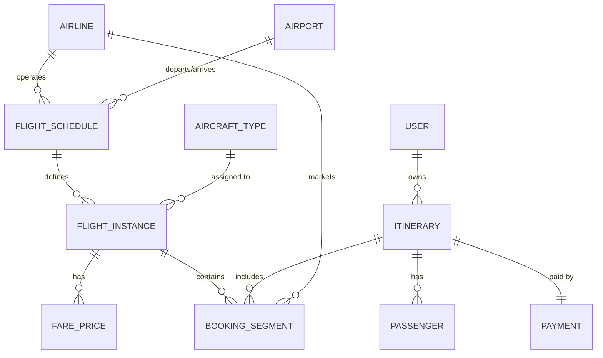

# Entity Design for Flight Search and Booking System (Junie's Revised Version)

This document provides a refined entity analysis for a flight search and booking system, addressing logical inconsistencies and reflecting industry realities as identified in the review dated 2025-12-22.

## Key Entities and Their Attributes

### 1. Airline
- Represents a company that operates or markets flights.
- **Attributes**:
    - `AirlineID` (UUID)
    - `IATA_Code` (e.g., AA, DL, BA)
    - `ICAO_Code` (e.g., AAL, DAL, BAW)
    - `Name` (e.g., American Airlines)
    - `Alliance` (e.g., Oneworld, SkyTeam, Star Alliance)
- **Purpose**: Essential for identifying the operating carrier and marketing carriers (code-sharing).

### 2. Airport
- Represents a geographical location for flight departures and arrivals.
- **Attributes**:
    - `AirportID` (UUID)
    - `IATA_Code` (e.g., LHR, JFK, SIN)
    - `Name` (e.g., London Heathrow)
    - `City`, `Country`
    - `TimeZone` (IANA format, e.g., "Europe/London")
    - `Coordinates` (Latitude/Longitude)
- **Purpose**: Facilitates route planning and time calculation.

### 3. FlightSchedule (The "Concept" of a Flight)
- Represents a recurring flight plan (e.g., AA100 every Monday at 10:00).
- **Attributes**:
    - `ScheduleID` (UUID)
    - `FlightNumber` (e.g., 100)
    - `OperatingCarrierID` (FK to Airline)
    - `DepartureAirportID` (FK to Airport)
    - `ArrivalAirportID` (FK to Airport)
    - `ScheduledDepartureTime` (Local time)
    - `ScheduledArrivalTime` (Local time)
    - `DaysOfOperation` (Bitmask or list: Mon, Tue, etc.)
    - `EffectiveFrom`, `EffectiveTo` (Dates)
- **Purpose**: Separates the schedule from specific daily instances.

### 4. FlightInstance (The "Physical" Flight)
- Represents a specific occurrence of a FlightSchedule on a specific date.
- **Attributes**:
    - `FlightInstanceID` (UUID)
    - `ScheduleID` (FK to FlightSchedule)
    - `DepartureDateTimeUTC` (Actual/Estimated)
    - `ArrivalDateTimeUTC` (Actual/Estimated)
    - `Status` (Scheduled, Boarding, Delayed, Cancelled, Arrived)
    - `AircraftTypeID` (FK to Aircraft)
    - `Gate`
- **Purpose**: Tracks real-time status and specific flight data.

### 5. AircraftType
- Defines the capacity and configuration.
- **Attributes**:
    - `AircraftTypeID` (e.g., "B738")
    - `ModelName` (e.g., Boeing 737-800)
    - `CapacityByCabin` (JSON or separate table: Economy: 150, Business: 12)
- **Purpose**: Used to calculate real-time seat availability by comparing capacity against bookings.

### 6. FareClass / Price
- Handles dynamic pricing and inventory buckets.
- **Attributes**:
    - `PriceID` (UUID)
    - `FlightInstanceID` (FK to FlightInstance)
    - `CabinClass` (Economy, Premium Economy, Business, First)
    - `FareBasisCode` (e.g., Y, J, O)
    - `BaseAmount` (Integer/Long with Scale)
    - `TaxAmount` (Split into YQ, Airport Tax, Govt Tax)
    - `Currency` (ISO 4217)
- **Purpose**: Manages complex pricing logic and inventory control.

### 7. Itinerary (PNR - Passenger Name Record)
- The primary container for a travel reservation.
- **Attributes**:
    - `PNR_RecordLocator` (6-character alphanumeric code)
    - `UserID` (FK to User)
    - `BookingStatus` (Confirmed, Waitlisted, Cancelled)
    - `CreatedAt` (Timestamp)
- **Purpose**: Acts as the parent for all flight segments and passengers in a single trip.

### 8. BookingSegment
- Connects a specific FlightInstance to an Itinerary.
- **Attributes**:
    - `SegmentID` (UUID)
    - `PNR_RecordLocator` (FK to Itinerary)
    - `FlightInstanceID` (FK to FlightInstance)
    - `MarketingCarrierID` (FK to Airline - handles code-sharing)
    - `SeatNumber`
    - `CabinClass`
- **Purpose**: Allows a single Itinerary to have multiple legs (JFK-LHR, LHR-DXB).

### 9. Passenger
- Details of individuals traveling.
- **Attributes**:
    - `PassengerID` (UUID)
    - `PNR_RecordLocator` (FK to Itinerary)
    - `FirstName`, `LastName`, `DOB`
    - `PassportNumber`, `Nationality`
    - `FrequentFlyerNumber`
- **Purpose**: Links travelers to the PNR.

### 10. Payment
- **Attributes**:
    - `PaymentID`, `PNR_RecordLocator`, `Amount`, `Status`, `TransactionDate`

---

## Entity Relationships

- **Airline ↔ FlightSchedule**:
    - An Airline **operates** many FlightSchedules (1:M).
    - An Airline can **market** (code-share) many FlightSchedules (M:N via BookingSegment).
- **Airport ↔ FlightSchedule**:
    - An Airport handles many departures and arrivals (M:1).
- **FlightSchedule ↔ FlightInstance**:
    - A Schedule defines many Instances (1:M).
- **Itinerary (PNR) ↔ BookingSegment**:
    - An Itinerary contains one or more Segments (1:M).
- **Itinerary (PNR) ↔ Passenger**:
    - An Itinerary can include multiple Passengers (1:M).
- **FlightInstance ↔ BookingSegment**:
    - A FlightInstance can be part of many BookingSegments (1:M). Availability is `AircraftCapacity - Count(Segments)`.

---

## ER Diagram (Mermaid)

---

## Refinements on Realities

1.  **Code-Sharing**: Handled by distinguishing between the `OperatingCarrier` in `FlightSchedule` and the `MarketingCarrier` in `BookingSegment`.
2.  **Time Zones**: All operational timestamps (`DepartureDateTimeUTC`, `ArrivalDateTimeUTC`) are stored in **UTC** to ensure consistency across borders. Local times are calculated using the `Airport.TimeZone` attribute.
3.  **Pricing Complexity**: Taxes and Fees are decoupled from the `BaseAmount` to allow for granular reporting (YQ, Govt, etc.).
4.  **Seat Availability**: Not a static counter on the `Flight` entity. It is dynamically calculated by checking `AircraftType` capacity against active `BookingSegments` for that `FlightInstance`.
5.  **Stopovers/Legs**: Naturally supported by the `Itinerary` -> `BookingSegment` (1:M) relationship. A multi-leg journey (e.g., JFK-LHR-DXB) is one PNR with two segments.
